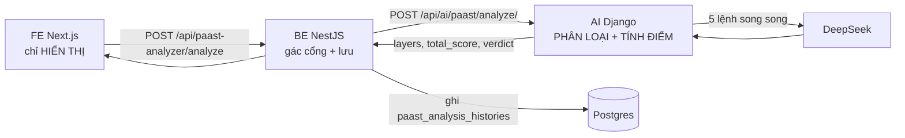

# Chấm điểm PAAST — cách hệ thống thật sự xử lý

Tài liệu mô tả đường đi của một lần chấm điểm, từ lúc người dùng bấm nút tới lúc con số hiện ra
màn hình. Viết theo code đang chạy (đọc ngày 07/08/2026), không theo tài liệu nghiệp vụ gốc.

**Nguyên tắc kiến trúc quan trọng nhất:** LLM chỉ **phân loại**, Python **tính điểm**.
Mô hình không bao giờ được đưa ra con số. Nhờ vậy cùng một phân loại luôn cho cùng một điểm,
và chấm lại sau khi nâng cấp nội dung không bị lệch thang so với lần chấm đầu.

---

## 1. Ba tầng, mỗi tầng làm đúng một việc



| Tầng | Làm gì | Có tính điểm không |
|---|---|---|
| **AI** — [paast_analysis_service.py](../video_management/services/paast_analysis_service.py) | Gọi LLM phân loại, chuẩn hoá, tính điểm, ra kết luận | **Có — nơi duy nhất** |
| **BE** — [paast-analyzer.service.ts](../../AutomationGenVideo_BE/src/modules/paast-analyzer/paast-analyzer.service.ts) | Chặn đầu vào không hợp lệ, cắt độ dài, cache, lưu lịch sử | Không |
| **FE** — [PaastScoreModal.tsx](../../AutomationGenVideo_FE/src/components/task-auto/PaastScoreModal.tsx) | In số nhận được ra màn hình | Không |

---

## 2. Hai bản đang chạy song song

| | **Bản 1** | **Bản 2** |
|---|---|---|
| Dùng cho | Luồng duyệt content (task-auto) | Video kênh nội bộ |
| Kết quả | Điểm 0–100, mỗi lớp tối đa 20 | Bỏ hẳn điểm số, chỉ ĐẠT / CHƯA ĐẠT |
| Thêm | — | 16 hook gợi ý |
| Endpoint AI | `POST /api/ai/paast/analyze/` | `POST /api/ai/paast/analyze-v2/` |
| Hàm | `PaastAnalysisService.analyze()` | `PaastAnalysisServiceV2.analyze_v2()` |
| Dấu hiệu trong DB | `total_score` có giá trị | `total_score = NULL`, JSON có `phien_ban: 2` |

Bản 2 **kế thừa nguyên phần phân loại của bản 1**, chỉ đổi cách quy đổi kết quả ra ngoài.
Cố ý không đụng `analyzeContent()` bản 1 vì task-auto đang chạy thật trên đó.

---

## 3. Sáu bước xử lý

### Bước 1 — Gác cổng đầu vào

Hai chốt, ở hai nơi khác nhau:

**BE** ([owned-script.service.ts `chamDiem()`](../../AutomationGenVideo_BE/src/modules/scraper-aggregate/owned-script.service.ts)) — chỉ áp dụng cho video kênh nội bộ:

| Chốt | Vì sao |
|---|---|
| Chặn kịch bản tiếng Thái (`th`, `vi_VN` từ Whisper/phụ đề Facebook) | Bộ tiêu chí và prompt PAAST viết bằng tiếng Việt. Đưa tiếng Thái vào vẫn ra một bản chấm trông như thật nhưng vô nghĩa — thà nói thẳng là chưa hỗ trợ |
| Cắt kịch bản > 3.000 ký tự **tại ranh giới câu gần nhất** | Video dài bóc ra tới 5.320 ký tự (đo được), trước đây rơi thẳng vào nhánh lỗi và không chấm được gì. Giữ đầu bỏ đuôi vì hook và insight chủ đạo nằm ở phần mở đầu — nơi PAAST soi kỹ nhất |
| Đã chấm rồi thì trả bản cũ qua `paast_analysis_id` | Nếu tra bằng `findLatestByContent()` thì hàm đó lọc theo `user_id`, mỗi đồng nghiệp mở cùng một video lại tốn thêm một lượt LLM **và cho ra điểm khác nhau** |

**AI** ([paast_analysis_views.py](../video_management/views/paast_analysis_views.py)): `100 ≤ len(content) ≤ 3000`, ngoài khoảng trả `400`.

### Bước 2 — LLM phân loại (`_classify`, dòng 223-242)

5 lệnh gọi DeepSeek **chạy song song** qua `ThreadPoolExecutor`, mỗi lớp một lệnh:

```
prefer  ─┐
action  ─┤
acknow. ─┼─→ ThreadPoolExecutor(max_workers=5) ─→ chờ = lệnh CHẬM NHẤT
stick   ─┤                                          (không phải tổng 5 lệnh)
trust   ─┘
```

Tham số: `temperature=0.2`, `max_tokens=2048`, `timeout=45s` mỗi lệnh.

Vì sao tách 5 lệnh thay vì một prompt gộp cả 36 tiêu chí: giảm độ trễ, và giảm rủi ro response bị
cắt cụt — mỗi lệnh giờ chỉ cần trả tối đa 6 tiêu chí.

LLM được yêu cầu trả JSON với **trích dẫn nguyên văn** câu trong content làm bằng chứng, cấm diễn
giải lại, cấm bịa câu không có trong content. Một lớp hỏng là cả lượt hỏng (`RuntimeError`).

### Bước 3 — Chuẩn hoá (`_normalize_classification`, dòng 250-307)

Không tin LLM trả đủ. Duyệt theo **định nghĩa gốc** trong code, không theo response:

- Thiếu tiêu chí nào → mặc định `miss` (Prefer là `off`)
- Status lạ ngoài `pass|miss` / `primary|secondary|off` → ép về `miss` / `off`
- `miss` mà không có gợi ý → tự sinh câu gợi ý từ `signal` của tiêu chí đó
- 4 tiêu chí Stick thuộc nhóm production → gán cứng `na`, **không gửi cho LLM**

Sau bước này chắc chắn có đúng 36 phần tử: 6 Prefer + 6 Action + 6 Acknowledge + 6 Stick + 6 Trust.

### Bước 4 — Tính điểm (`compute_scores`, dòng 313-351)

Python thuần, không LLM. 5 lớp × 20 = 100:

| Lớp | Công thức |
|---|---|
| **P**refer | `min(20, primary×10 + secondary×2)` |
| **A**ction | `(số pass / 6) × 20` |
| **A**cknowledge | `(số pass / 6) × 20` |
| **S**tick | `(số pass / số tiêu chí KHÔNG phải na) × 20` → mẫu số là **2**, không phải 6 |
| **T**rust | `(số pass / 6) × 20` |

**Cái bẫy đã ghi trong docstring:** tổng cộng từ giá trị **chưa làm tròn** rồi mới làm tròn một
lần duy nhất ở cuối. Làm tròn từng lớp trước rồi cộng lại sẽ lệch.

Hệ quả nhìn thấy được trên màn hình — điểm từng lớp cộng lại **không bằng** tổng:

| Lớp | Đạt | Điểm thật | Hiện ra |
|---|---|---|---|
| Prefer | 1 primary + 1 secondary | 12.000 | 12.0 |
| Action | 5/6 | 16.667 | 16.7 |
| Acknowledge | 5/6 | 16.667 | 16.7 |
| Stick | 1/2 | 10.000 | 10.0 |
| Trust | 5/6 | 16.667 | 16.7 |
| | | **72.000 → 72** | cộng tay ra **72.1** |

Đây là **đúng thiết kế**, không phải lỗi. 72 mới là con số thật.

### Bước 5 — Kết luận đạt/chưa (`compute_verdict`, dòng 357-392)

**Không có ngưỡng điểm tổng.** Điểm cao vẫn có thể trượt.

> Đạt chuẩn khi **cả 5 lớp đều có ít nhất 1 tiêu chí đạt**.

Vì sao không dùng ngưỡng: điểm cao vẫn có thể do dồn hết vào vài lớp trong khi bỏ trắng hẳn một
lớp khác. 80 điểm mà trống lớp Trust thì vẫn là content không dùng được.

Hai ngoại lệ:

1. **Prefer đòi ít nhất 1 insight `primary`** — `secondary` không tính
2. **Stick**: nếu không tiêu chí nào detect được từ text thì bỏ qua, không tính là lý do trượt

> ⚠️ Ngoại lệ (2) hiện **không bao giờ chạy**: `_normalize_classification` luôn sinh đủ 2 tiêu chí
> Stick text-detectable, nên `text_detectable_count` luôn bằng 2. Nhánh phòng thủ này là code chết.
> Vô hại, nhưng đừng dựa vào nó.

### Bước 6 — Cảnh báo CTA (`check_cta_compliance`, dòng 398-405)

Regex thuần, không LLM, chạy độc lập và **không ảnh hưởng điểm**. Bắt 13 mẫu bán hàng lộ liễu:
`mua ngay`, `chốt đơn`, `sale \d+%`, `còn \d+ suất`, `nhanh tay`, `like page`…

---

## 4. Toàn bộ 36 tiêu chí

### Prefer — 6 insight (đánh giá TỔNG THỂ toàn bài)

Trạng thái: `primary` (≥3 câu bằng chứng **và** là chủ đề xuyên suốt) · `secondary` (1–2 câu, không
phải chủ đề chính) · `off`.

| Mã | Tên | Dấu hiệu |
|---|---|---|
| C | Tò mò | Câu hỏi mở, thông tin trái ngược, sự kiện kỳ lạ, twist bất ngờ |
| R | Cảm xúc mạnh | Nỗi đau/ước mơ, con số sốc, tình huống nguy hiểm, cảm hứng |
| A | Giác quan | Mô tả trực quan hình ảnh, âm thanh, bối cảnh đẹp |
| V | Sống thay | POV nhập vai, theo chân nhân vật, nơi ít người biết |
| E | Học hỏi & phát triển | Tips, checklist, framework, kiến thức chuyên môn |
| S | Cái tôi khác biệt | Nhấn tính hiếm, "dành riêng cho", nhóm ≤ 1% |

### Action — S-FACES (đánh giá từng câu/đoạn)

| Mã | Tên | Dấu hiệu |
|---|---|---|
| STOP | Dừng lại (Hook) | Câu mở hook mạnh — twist, câu hỏi ngược, con số sốc trong 1-2 dòng đầu |
| FEEL | Cảm nhận (Like) | Đoạn chạm nỗi đau/ước mơ/trải nghiệm |
| ANSWER | Đối thoại (Comment) | Câu hỏi mở, mời chia sẻ quan điểm, gợi tranh luận |
| CONNECT | Kết nối (Share) | Câu chốt súc tích dễ trích, thay lời một nhóm |
| ENGAGE | Gắn bó (Save) | Tips/formula/checklist đủ dense để save |
| SEE_AGAIN | Xem lại (Rewatch) | Nhiều lớp info, chi tiết ẩn, câu chốt sâu |

### Acknowledge — BRANDS

| Mã | Tên | Dấu hiệu |
|---|---|---|
| BASICS | Nền tảng cốt lõi | "Mình là ai, mình làm gì" tự nhiên trong story |
| REASONS | Lý do lựa chọn | Điểm khác biệt/ưu nhược so với lựa chọn khác |
| AUDIENCE | Khách hàng mục tiêu | Chân dung KH cụ thể — "lần đầu…", "bạn cũng như tôi…" |
| NEEDS_CONTEXT | Bối cảnh sử dụng | Tình huống đời thường khi cần sản phẩm |
| DEEPER_VALUE | Giá trị sâu hơn | Lợi ích cảm xúc vượt trên công dụng |
| STORY | Câu chuyện & Tầm nhìn | Gốc gác, hành trình, tầm nhìn brand |

### Stick — 2 chấm được + 4 luôn `na`

| Mã | Tên | Chấm được từ text? |
|---|---|---|
| SIGNATURE_FACE | Diện mạo IP | ✅ Nhân vật xưng danh, có thể phát triển thành IP |
| CORE_MANTRA | Thần chú cốt lõi | ✅ Câu ngắn có thể lặp lại như mantra |
| THEMED_STAGE | Bối cảnh đặc trưng | ❌ cần production |
| ICONIC_TOTEM | Đạo cụ biểu tượng | ❌ cần production |
| KINETIC_RITUAL | Nghi thức chuyển động | ❌ cần production |
| SONIC_EMOTION | Âm thanh cảm xúc | ❌ cần production |

### Trust — TRUSTS

| Mã | Tên | Dấu hiệu |
|---|---|---|
| TRANSPARENCY | Minh bạch | Hậu trường, quy trình, khó khăn thật |
| RESPONSIBILITY | Trách nhiệm xã hội | Cam kết môi trường, cộng đồng |
| UNBIASED_AUTHORITY | Chứng thực chuyên gia | Chuyên gia, KOL, chứng chỉ ngành |
| SOCIAL_PROOF | Xã hội chứng thực | Feedback thật, số lượng KH, case study |
| TANGIBLE_EVIDENCE | Thực chứng | Số liệu, giải thưởng, chứng nhận |
| STORYTELLING_HUMAN_TOUCH | Nhân hoá | Câu chuyện founder / nhân viên / KH thật |

---

## 5. Bản 2 khác chỗ nào (`analyze_v2`, dòng 623-677)

- Dùng lại `_classify` + `_normalize_classification` y hệt bản 1
- **Bỏ hết điểm số**, chỉ đếm `elementCount` mỗi lớp
- Đạt chuẩn: Prefer có ≥1 `primary` **và** cả 4 lớp còn lại đều có ≥1 `pass` — cùng quy tắc bản 1,
  chỉ diễn đạt khác
- Thêm **16 hook gợi ý** (`_generate_hooks`, `temperature=0.8` — cao hơn phần phân loại vì đây là
  việc sáng tạo). Sinh hook hỏng thì trả danh sách công thức không kèm ví dụ, **không ném lỗi** —
  hook chỉ là phần thêm, không đáng làm hỏng bản phân tích đã chấm xong
- Key JSON trả về đổi sang camelCase cho FE

---

## 6. Lưu vào đâu

Cả hai bản ghi chung bảng `paast_analysis_histories`:

| Cột | Nội dung |
|---|---|
| `input_text` | Kịch bản đã cắt |
| `analysis_result` | JSON `{ layers, verdict, cta_warning }` |
| `total_score` | 0–100 (bản 1) hoặc `NULL` (bản 2) |
| `status` | `PENDING` → `SUCCESS` / `FAILED` |
| `model_used` | `deepseek-chat` |
| `duration_ms` | Thời gian chạy |
| `upgraded_from_id` | Trỏ về bản gốc khi nâng cấp content |

Kịch bản video nội bộ nằm bảng riêng `owned_video_scripts`, có cột `paast_analysis_id` trỏ sang bản
chấm mới nhất. Tách hai bảng vì **PAAST chấm kịch bản, mà video cào về chỉ có caption**.

Bản ghi được tạo với `status=PENDING` **trước** khi gọi AI, nên lần chạy hỏng vẫn để lại vết
`FAILED` kèm `error_message` — không mất dấu.

---

## 7. Muốn sửa thì sửa ở đâu

| Muốn đổi | Sửa file | Sửa chỗ |
|---|---|---|
| Trọng số / thang điểm | `paast_analysis_service.py` | `compute_scores` (313) |
| Điều kiện đạt chuẩn | `paast_analysis_service.py` | `compute_verdict` (357) |
| Thêm/bớt tiêu chí | `paast_analysis_service.py` | hằng số dòng 27-124 |
| Cách hỏi LLM | `paast_analysis_service.py` | `_build_group_prompt` (156) |
| Mẫu CTA cấm | `paast_analysis_service.py` | `CTA_VIOLATION_PATTERNS` (127) |
| Giới hạn độ dài | `paast_analysis_views.py` | `MIN/MAX_CONTENT_LENGTH` (14-15) |
| Cách cắt kịch bản dài | `owned-script.service.ts` (BE) | `chamDiem()` |

Sửa xong chạy [tests/test_paast_scoring.py](../tests/test_paast_scoring.py).

**BE và FE không phải đụng tới** — đó là cái được của thiết kế này. Cái mất: FE không kiểm tra chéo
được số AI trả về, sai công thức thì sai im lặng ở cả ba tầng. File test trên là chốt chặn duy nhất.
